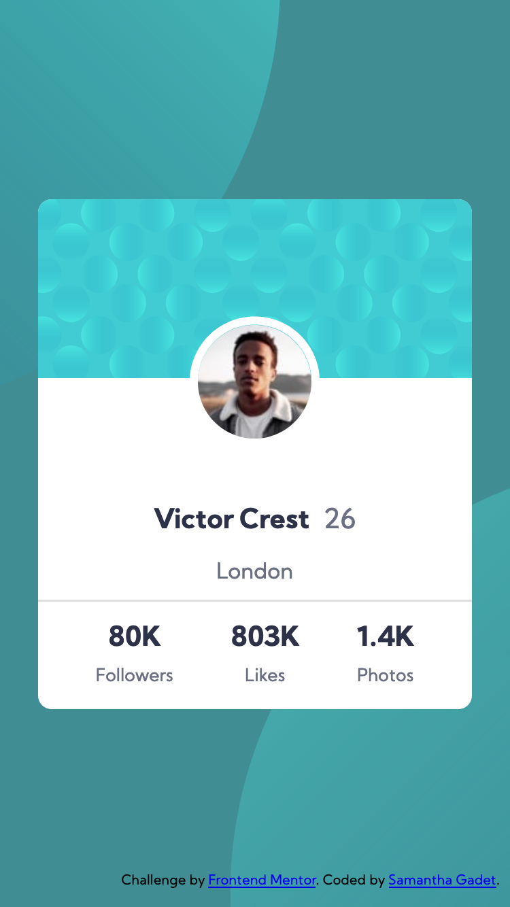
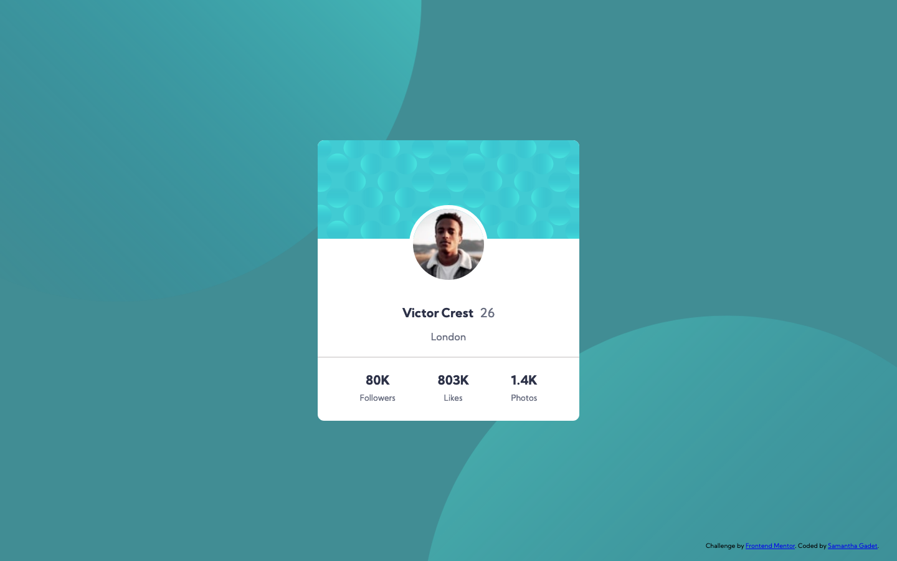

# Frontend Mentor - Profile card component solution

This is a solution to the [Profile card component challenge on Frontend Mentor](https://www.frontendmentor.io/challenges/profile-card-component-cfArpWshJ). Frontend Mentor challenges help you improve your coding skills by building realistic projects.

## Table of contents

- [The challenge](#the-challenge)
- [Screenshot](#screenshot)
- [Built with](#built-with)
- [What I learned](#what-i-learned)
- [Author](#author)

### The challenge

- Build out the project to the designs provided

### Screenshot

### Built with

- Semantic HTML5 markup
- Flexbox

### What I learned

In this challenge I have learned how to size and position a background.

## Author

- Website - [Samantha Gadet](https://github.com/Samy0412)
- Frontend Mentor - [@Samy0412](https://www.frontendmentor.io/profile/Samy0412)
